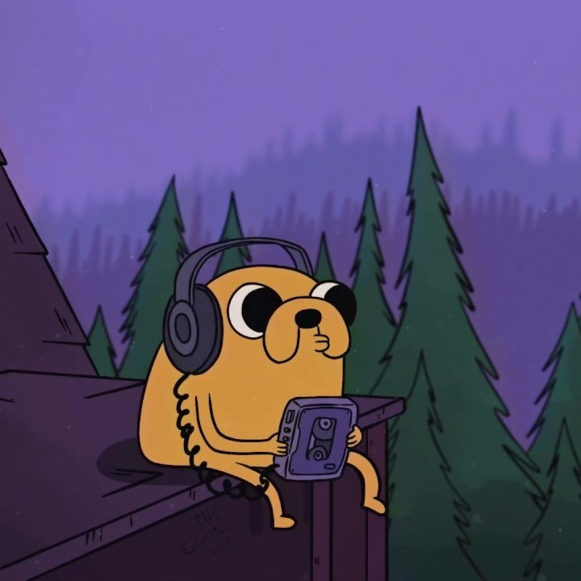

<br />
<p align="center">

  <a href="https://daiji-bot.com/">
    
  </a>

  <h3 align="center">"Daiji" Discord Bot</h3>

  <p align="center">
    You, your friends, and some good tunes.
    <br />
    <a href="https://daiji-bot.com/"><strong>View website »</strong></a>
    <br />
    <br />
    <a href="https://github.com/deithy/discord-bot/issues">Report bug</a>
    ·
    <a href="https://github.com/deithy/discord-bot/issues">Request Feature</a>
  </p>
</p>

<!-- TABLE OF CONTENTS -->
<details>
  <summary>Table of Contents</summary>
  <ol>
    <li>
      <a href="#about-the-project">About The Project</a>
      <ul>
        <li><a href="#commands">Commands</a></li>
        <li><a href="#built-with">Built With</a></li>
      </ul>
    </li>
    <li>
      <a href="#getting-started">Getting Started</a>
      <ul>
        <li><a href="#prerequisites">Prerequisites</a></li>
        <li><a href="#installation">Installation</a></li>
      </ul>
    </li>
    <li><a href="#license">License</a></li>
    <li><a href="#contact">Contact</a></li>
    <li><a href="#acknowledgements">Acknowledgements</a></li>
  </ol>
</details>

## About The Project

Daiji brings music from youtube directly to your voice channel allowing you to listen to music of
your choice with your friends. It supports direct youtube links and links to playlists.

### Commands

- [x] Help - List all commands
- [x] Ping - Test bot latency
- [x] Move - Summon bot to channel
- [x] Leave - Kick bot from channel
- [x] Play - Start playing YouTube link
- [x] Pause - Hold playback
- [x] Resume - Resume playback
- [x] Volume - Control playback volume

### Built With

Major tools used are listed below, to see the full list go to acknowledgements.

- [Discord API](https://discord.com/developers)
-

## Getting Started

If you would like to see how the project works you may want to install it on your machine.

To get a local copy up and running follow steps below.

### Prerequisites

Node and npm are required to install and run the project.

### Installation

1. Clone the repo
   ```sh
   git clone https://github.com/deithy/discord-bot.git
   ```
2. Install NPM packages
   ```sh
   npm install
   ```
3. Run on your machine
   ```sh
   npm start
   ```

## License

Distributed under the MIT License. See `LICENSE` for more information.

## Contact

Arnold Kokot - [@deithyy](https://twitter.com/deithyy) - ogkokot@gmail.com

Project Link: [https://github.com/deithy/discord-bot](https://github.com/deithy/discord-bot)

## Acknowledgements

bot:

- [FFmpeg](https://ffmpeg.org/download.html)
- [Opus encoder](https://www.npmjs.com/package/@discordjs/opus)
- [YTDL core](https://github.com/fent/node-ytdl-core)
- [Discord.js](https://discord.js.org/#/)
- [Dotenv](https://www.npmjs.com/package/dotenv)

daiji-bot.com website:

- [Material design](https://redux-toolkit.js.org/)
- [Create react app](https://create-react-app.dev/)
- [React](https://reactjs.org/)
